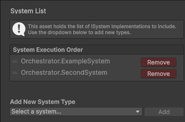
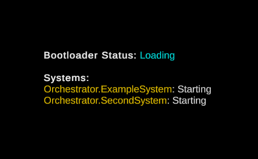

# UniOrchestrator

UniOrchestrator is a lightweight & easy-to-use package to manage the execution order of your systems/controllers/managers while also handling dependencies automatically.

## Installation

Install UniOrchestrator and UniTask via the UPM window in the editor.

Window => Package Manager => Install package from git url:

1. `https://github.com/tatelax/UniOrchestrator/tree/main`
2. `https://github.com/Cysharp/UniTask.git?path=src/UniTask/Assets/Plugins/UniTask`

## Quickstart

1. Create a Settings file in a Resources directory. `Create/Orchestrator/Settings`
2. Create a System List file in a Resources directory. `Create/Orchestrator/System List`
3. Assign that System List file under the System List field in your Settings file.
4. Create a new .cs file which implements the ISystem interface.
5. Assign your new system in the System List file.

Drag to reorder systems in the System List file to change execution order of the Update loop for your systems. Create multiple System List files for different scenarios.



## Example

```cs
  public class ExampleSystem : ISystem
  {
    public async UniTask Init()
    {
      await UniTask.Delay(3000);

      Debug.Log($"Even though I'm first in the execution order, I won't initialize until SecondSystem is initialized since I depend on it.");

      var secondSystem = await Orchestrator.GetSystemAsync<SecondSystem>();
      
      Debug.Log($"SecondSystem is now initialized and it's value is {secondSystem.foo}.")
    }

    public void Update()
    {
      Debug.Log("I'll run every frame despite not being a MonoBehaviour.");
    }
  }
```

```cs
  public class SecondSystem : ISystem
  {
    public ushort foo = 123;
    
    public async UniTask Init()
    {
      await UniTask.Delay(5000);
      
      Debug.Log("Second system is now ready");
    }
  }
```

